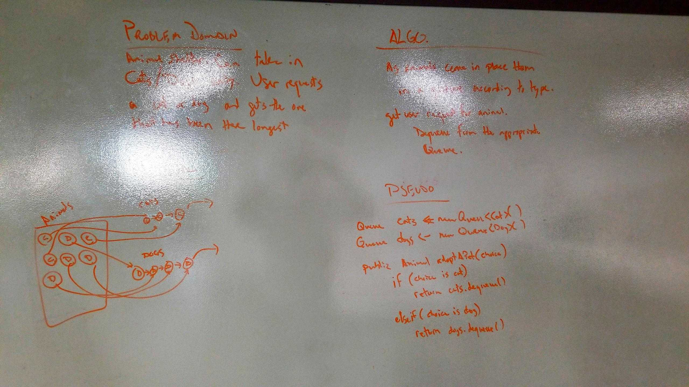

# Animal Shelter (Queues)

## Description
Write a function called insertShiftArray which takes in an array and the value to be added. Without utilizing any of the built-in methods available to your language, return an array with the new value added at the middle index.

## Approach & Efficiency
I created a queue for each type of animal - cat or dog - and stored each in the appropriate queue when it came in.

The Big O for this is O(1).  I can dequeue off the front of the queue, and with each animal I track the sequence it came into the shelter so that if the user does not specify I can just dequeue the animal with the lowest sequence.
 

## Solution
[Code](../src/main/java/code/challenges/AnimalShelter.java)

