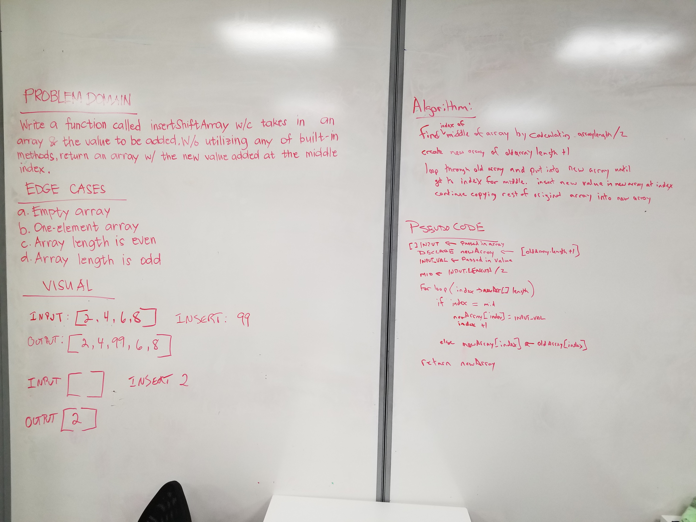

# Array Shift

## Description
Write a function called insertShiftArray which takes in an array and the value to be added. Without utilizing any of the built-in methods available to your language, return an array with the new value added at the middle index.

## Approach & Efficiency
We created a new array one slot larger than the input array and then transferred the old array over to the new array, adding the desired element in the middle and finished out adding in rest of the old array.

We haven't done any Big O stuff yet, but I think this is an O(n) operation as it is dependant on the size of the input array + 1.

## Solution
[Code](../src/main/java/code/challenges/ArrayShift.java)

