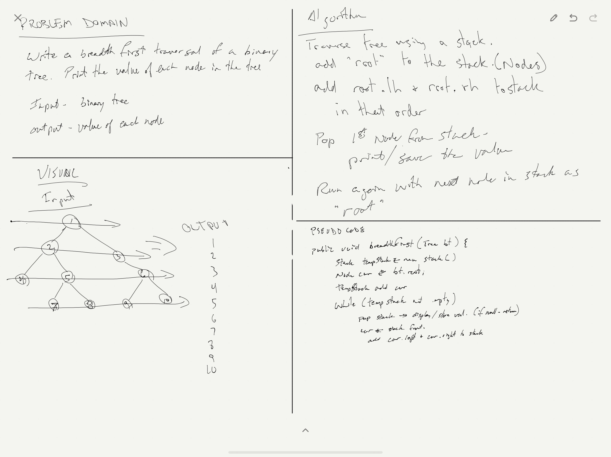

# [Breadth First Traversal](../src/main/java/code/challenges/tree/BinaryTree.java)
Conduct “FizzBuzz” on a tree while traversing through it. Change the values of each of the nodes dependent on the current node’s value

## Challenge Description
Write a breadth first traversal method which takes a Binary Tree as its unique input.   
Without utilizing any of the built-in methods available to your language, traverse the input tree using a Breadth-first approach; print every visited node’s value.

## Approach & Efficiency
I traversed through the tree in a breadth-first format, and printed the value of each node to console.
O(n) because we are checking every node.

## Solution

