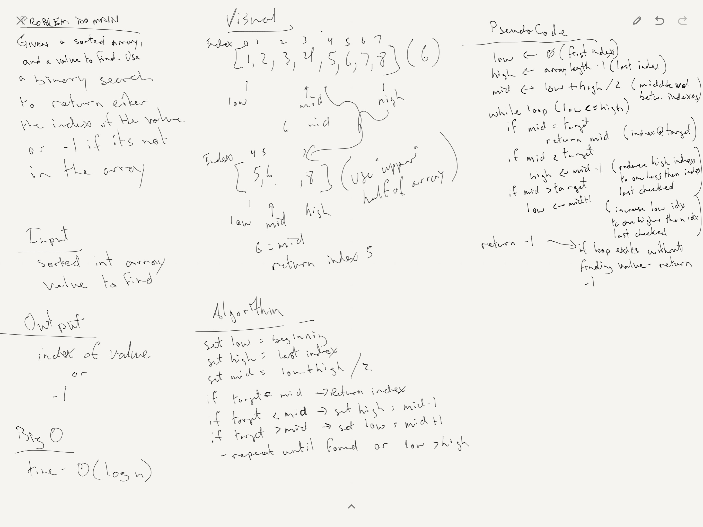

# Binary Search

## Description
A function called BinarySearch which takes in 2 parameters: a sorted array and the search key. Without utilizing any of the built-in methods available to your language, return the index of the array’s element that is equal to the search key, or -1 if the element does not exist.

## Approach & Efficiency
I created variables for min and max index and a midpoint half way between them.  Checking to see if the desired val was higher or lower than the midpoint I then adjusted the min or max to "get rid of" the unnecessary portion of the array.  Returning the index if the values matched.

Efficiency on this should be O(log n) due to effectively halving the size of the array being searched through on each iteration.

## Solution
[Code](../src/main/java/code/challenges/BinarySearch.java)

