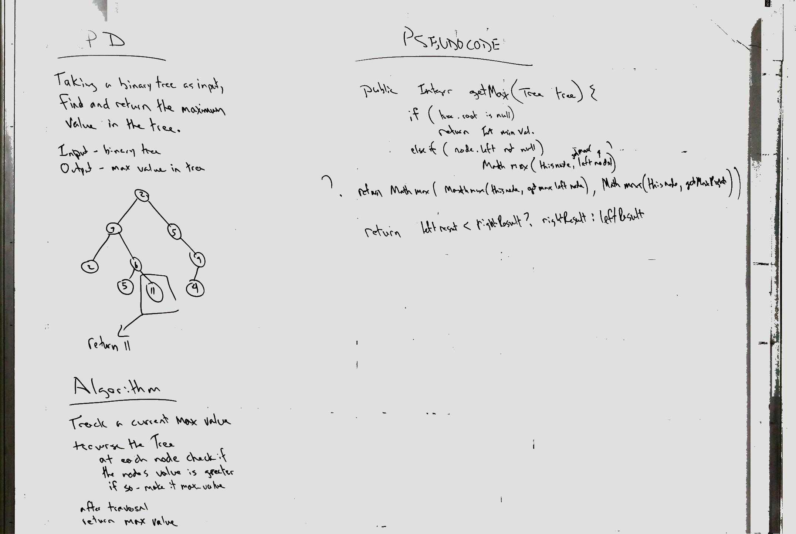

# [Binary Tree max value](../src/main/java/code/challenges/tree/BinaryTree.java)
Given a Binary tree, find the max value in the tree.

## Challenge Description
Write a function called find-maximum-value which takes binary tree as its only input. Without utilizing any of the built-in methods available to your language, return the maximum value stored in the tree.  
 You can assume that the values stored in the Binary Tree will be numeric.
## Approach & Efficiency
Used breadth first traversal, and compared each node to max.
O(n) because we are checking every node.

## Solution

