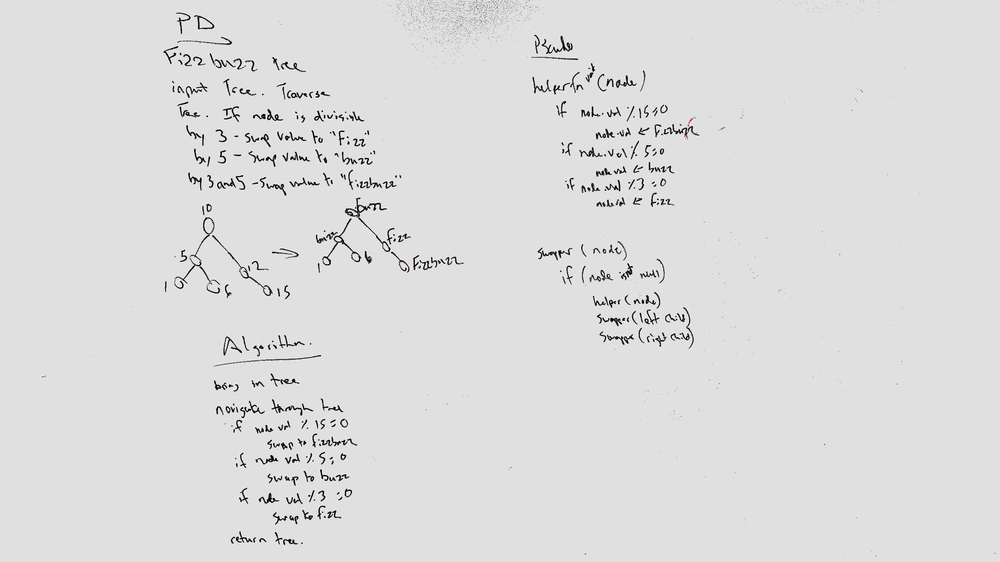

# [FizzBuzzTree](../src/main/java/code/challenges/MultiBracketValidation/FizzBuzzTree.java)
Conduct “FizzBuzz” on a tree while traversing through it. Change the values of each of the nodes dependent on the current node’s value

## Challenge Description
Without utilizing any of the built-in methods available to your language, determine weather or not the value of each node is divisible by 3, 5 or both, and change the value of each of the nodes:
If the value is divisible by 3, replace the value with “Fizz”
If the value is divisible by 5, replace the value with “Buzz”
If the value is divisible by 3 and 5, replace the value with “FizzBuzz”
Return the tree with its new values.

## Approach & Efficiency
I traversed through the tree in a pre-order format, checked each node and swapped accordingly.
O(n) because we are checking every node.

## Solution

