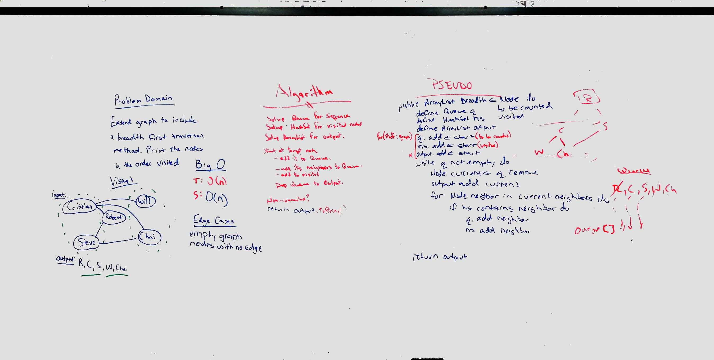

# Graph 

Implement a breadth-first traversal on a graph.

## Challenge

Extend your graph object with a breadth-first traversal method that accepts a starting node. Without utilizing any of the built-in methods available to your language, return a collection of nodes in the order they were visited. Display the collection.

## Approach & Efficiency

Used a queue to add nodes to be visited.  Dequed nodes added to output list
O(n) since we need to work through the whole graph.

## Solution
[Code](../src/main/java/code/challenges/Graph/Graph.java)  
<!---->
 