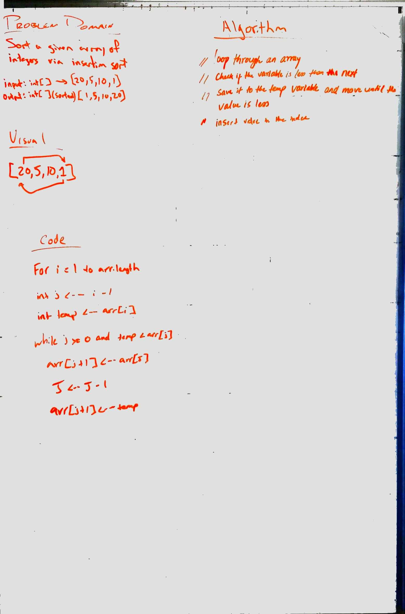

# Insertion Sort

## Description
Complete a working, tested implementation of Insertion Sort, based on the pseudo code provided

## Approach & Efficiency

The Big O for this is O(n^2)  I believe, due to the fact that you are iterating through a while loop inside a for loop and each could potentially be as long as the entire array.

## Solution
[Code](../src/main/java/code/challenges/Sort.java)

