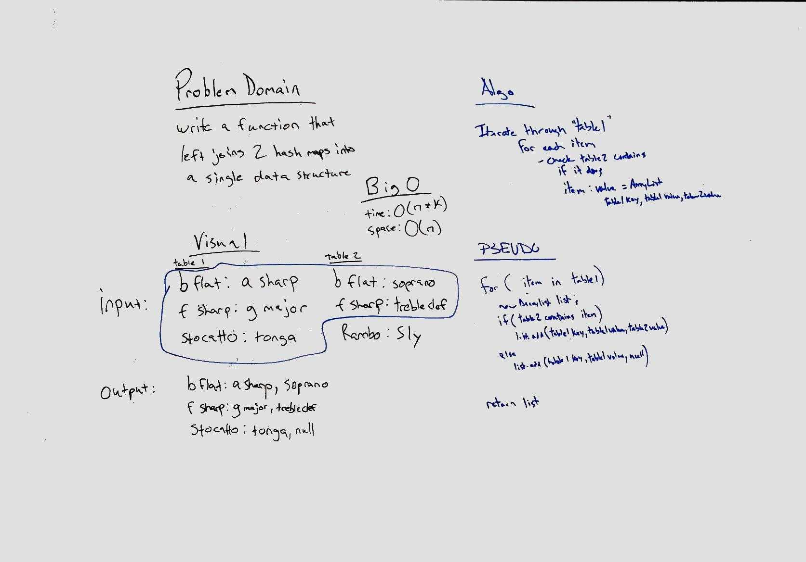

# Hashtables - Left Join

Implement a simplified LEFT JOIN for 2 Hashmaps.

## Challenge

- Write a function that LEFT JOINs two hashmaps into a single data structure.
- The first parameter is a hashmap that has word strings as keys, and a synonym of the key as values.
- The second parameter is a hashmap that has word strings as keys, and antonyms of the key as values.
- Combine the key and corresponding values (if they exist) into a new data structure according to LEFT JOIN logic.  
LEFT JOIN means all the values in the first hashmap are returned, and if values exist in the “right” hashmap, they are appended to the result row. If no values exist in the right hashmap, then some flavor of NULL should be appended to the result row.

## Approach & Efficiency

I iterated through the "left" table and for each value checked to see if it was in the "right" table.  If so I added the key, value and value2 to an arraylist to represent that "row"  
If the item was not in the "right" table I added it to the arraylist as key, value, null to ensure capture of the whole left "table"  

O(n * k) time where n is the "left" table and k is the "right" table.  This is because I am iterating through the right table looking for a match on each item in the left table.  
O(n) space since I am creating an array list of a size equal

## Solution
[Code](../src/main/java/code/challenges/LeftJoin/LeftJoin.java)  

 
