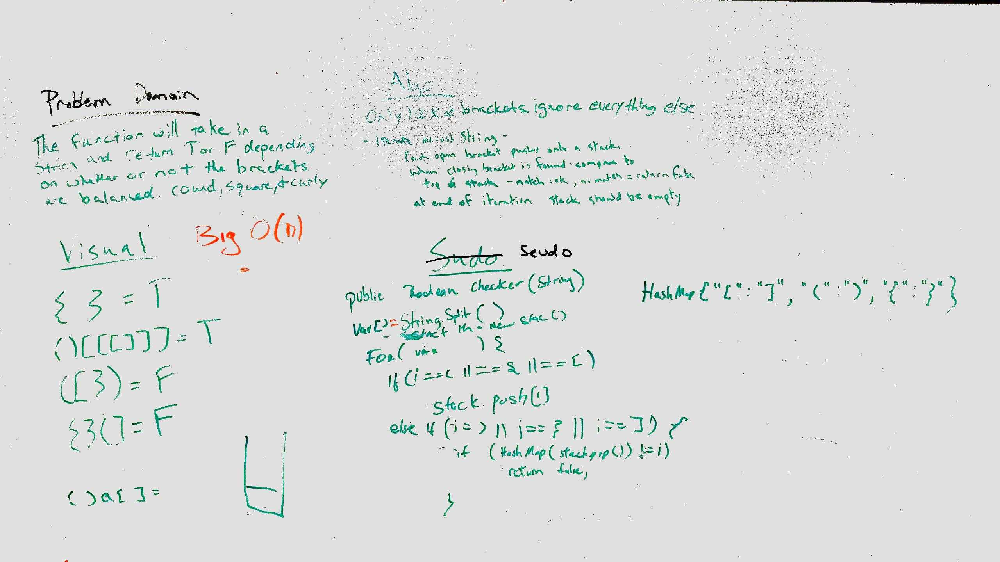

# [Multi Bracket Validation](../src/main/java/code/challenges/MultiBracketValidation/MultiBracketValidator.java) 
Validate whether a string containing bracket pairs are properly paired.

## Challenge Description
Your function should take a string as its only argument, and should return a boolean representing whether or not the brackets in the string are balanced. There are 3 types of brackets:

Round Brackets : ()  
Square Brackets : []  
Curly Brackets : {}

## Approach & Efficiency
Iterate through the string with for loop.  Put opening brackets in a stack, when closing bracket is encountered, compare to bracket on top of stack, should match.  
If no match return false, or if stack is empty return false.  If you get through the whole string and have an empty stack, it means you matched them all up.

### Efficiency
Time : O(n) - worst case you have to work through the entire string to see if it all matches.
Space: O(n) - worst case you have to put all the elements into a stack.

## Solution
