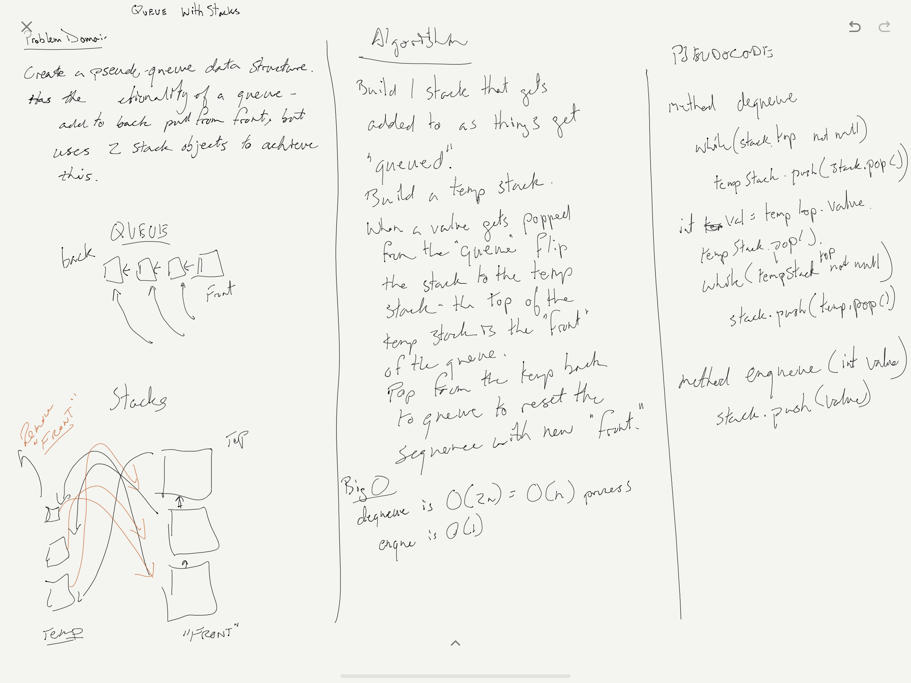

# Challenge Summary
### [PseudoQueue](../src/main/java/code/challenges/stacksandqueues/PseudoQueue.java)  
Implement a "queue-type" structure that functions as a queue but uses 2 stacks for its functionality.

## Challenge Description
Create a brand new PseudoQueue class. Do not use an existing Queue. Instead, this PseudoQueue class will implement our standard queue interface (the two methods listed below), but will internally only utilize 2 Stack objects. Ensure that you create your class with the following methods:

enqueue(value) which inserts value into the PseudoQueue, using a first-in, first-out approach.
dequeue() which extracts a value from the PseudoQueue, using a first-in, first-out approach.

## Approach & Efficiency
I chose to flip the main stack into a temp stack and pop from there to get the "front."
Adding to the "queue" was as simple as just pushing onto the top of the main stack.
- enqueue is a O(n) method since the top is tracked and can just be added to.
- dequeue is an O(2N) which is actually just O(n) since I need to flip through the stack 2 times in order to put it all into the temp stack and then back onto the main stack.

## Solution
