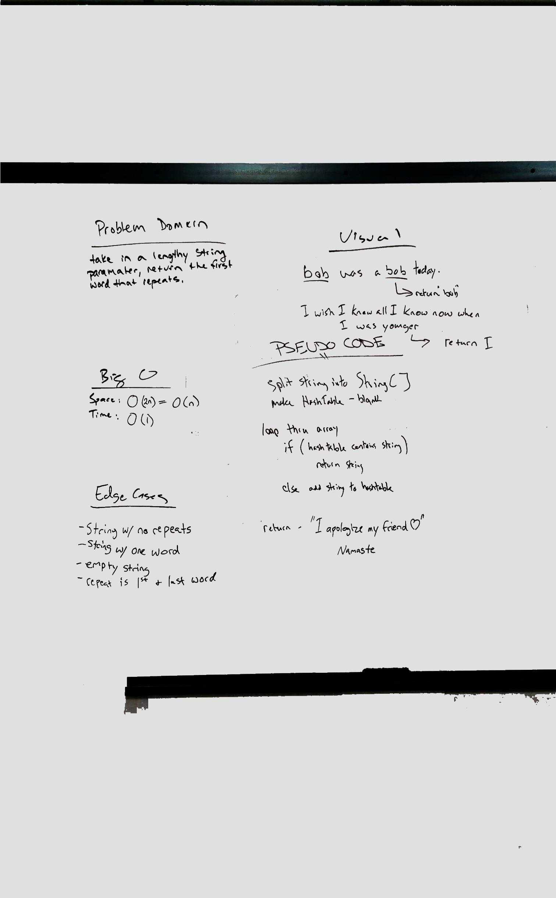

# Challenge Summary
### [Repeated Word](../src/main/java/code/challenges/RepeatedWord/RepeatedWord.java)  

Find the first repeated word in a book.

## Challenge Description

Write a function that accepts a lengthy string parameter.
Without utilizing any of the built-in library methods available to your language, return the first word to occur more than once in that provided string.

## Approach & Efficiency

I split the string into an array of sub-strings, and created a hash-table to store them in.  Iterating through the array I check to see if the word is in the hash table, if it is I return that word, as it is the first one that is repeated.  If not I add it to the hash table.

## Solution
