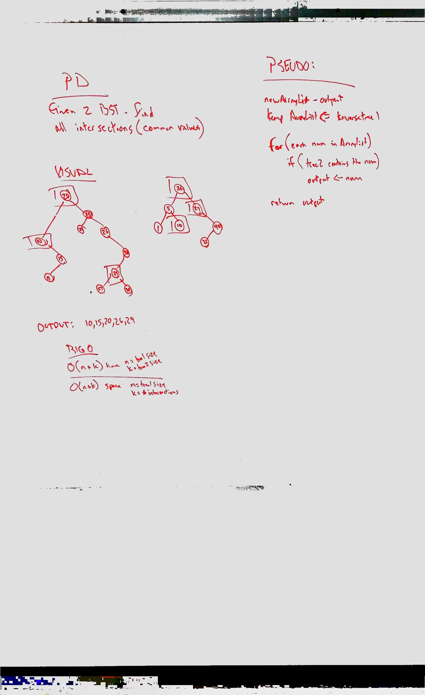

# Challenge Summary
### [Tree Intersection](../src/main/java/code/challenges/TreeIntersection/TreeIntersection.java)  

Find common values in 2 binary trees.

## Challenge Description

Without utilizing any of the built-in library methods available to your language, return a set of values found in both trees.

## Approach & Efficiency

I traversed the first tree and saved the values into an ArrayList, and created a new ArrayList to hold the intersections.
then I iterated through the array list of values and checked tree2 to see if it contained each value, if it did I saved it into the output list.

This takes O(n + k) time where n is the size of tree1 and k is the size of tree2.  
This takes O(n + k) as well where n is the size of the tree1 and k is the number of intersections.

## Solution
